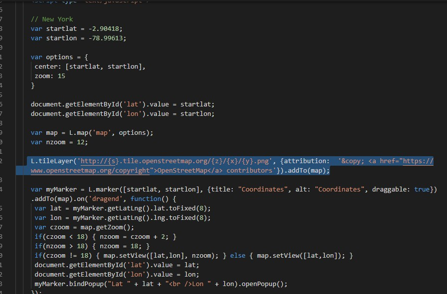

Cannabidiol.com

>   **Plan de Desarrollo de Software**

Versión 1.5

>   Tabla de Contenido

1.  [Introducción 3](#introducción)

    1.  [Propósito 3](#_bookmark1)

    2.  [Alcance 3](#_bookmark2)

    3.  [Definiciones, siglas y abreviaturas 3](#_bookmark3)

    4.  [Referencias 4](#_bookmark4)

2.  [Descripción general 4](#descripción-general)

    1.  [Perspectiva del producto 4](#_bookmark6)

[2.1.2 Interfaces de hardware 4](#_bookmark7)
=============================================

1.  [Funciones del producto 4](#_bookmark8)

2.  [Características de usuario 5](#_bookmark9)

3.  [Restricciones 5](#_bookmark10)

4.  [Documentación de usuario 6](#_bookmark11)

[3 Interfaces de hardware 6](#_bookmark12)
==========================================

1.  [Requerimientos Funcionales Administrador
    6](#requerimientos-funcionales-administrador.)

    1.  [Gestión de seguridad 6](#_bookmark14)

    2.  [Gestión de Usuarios 9](#_bookmark15)

    3.  [Gestion de Productos 10](#_bookmark16)

    4.  [Gestión de Pedidos 10](#_bookmark17)

    5.  [Gestión de Facturas 10](#_bookmark18)

2.  [Sección Publica 11](#sección-publica)

3.  [Sección Privada Usuario 14](#_bookmark20)

    1.  [Link del servidor con la página web 17](#_bookmark21)

        1.  [Fiabilidad 17](#_bookmark22)

        2.  [Seguridad 17](#_bookmark23)

        3.  [Mantenibilidad 17](#_bookmark24)

Introducción
------------

>   Este documento contiene los requerimientos de Software del proyecto de
>   desarrollo del Sistema de Venta de Cannabidiol online.

1.  *Propósito*

>   Este documento define y describe los requerimientos de operaciones,
>   desempeño y calidad del software del sistema de Ventas online. Este
>   documento está dirigido a todos los involucrados en el desarrollo del
>   proyecto, sirviendo como apoyo para dejar en claro los requerimientos
>   funcionales, no funcionales y las diferentes condiciones que regirán el
>   proyecto en todas las etapas de su desarrollo. Esta especificación permite
>   definir un marco de trabajo para la realización del sistema propuesto.

1.  *Alcance*

>   En este documento se definen los requerimientos no funcionales del sistema,
>   como usabilidad, confiabilidad, desempeño, entre otros, al igual que los
>   requerimientos funcionales del mismo, necesarios para los usuarios
>   propuestos.

1.  *Definiciones, siglas y abreviaturas*

    -   **Requerimientos funcionales**: describen las capacidades o funciones
        que el sistema será capaz de realizar.

    -   **Requerimientos no funcionales**: restricciones o características que
        de una u otra forma puedan limitar el sistema, como, por ejemplo,
        rendimiento, interfaces de usuario, fiabilidad, mantenimiento,
        seguridad, portabilidad, estándares, etc.

    -   **Documento:** Es todo relato escrito que describe un proceso, un
        procedimiento, un manual, un formato sin diligenciar entre otros.

    -   **Registro:** Evidencia objetiva de que algo se está haciendo, lo cual
        no puede ser cambiado o actualizado una vez se realice.

2.  *Referencias:*

-   Unidad_01_01_REQ_Intro

-   Raquel Toro, R. T. (2018, 3 abril). ISO 9001 2015 Diferencias entre proceso
    y procedimiento. Recuperado 27 diciembre, 2018, de https://www.nueva-iso-
    9001-2015.com/2016/01/iso-9001-2015-diferencia-proceso-procedimiento/

1.  Descripción general

    1.  *Perspectiva del producto*

>   Este sistema está enmarcado en un ambiente altamente competitivo, donde la
>   funcionabilidad es muy determinante y los datos al igual a almacenas son de
>   vital importancia para evaluar a sus clientes.

1.  Interfaces de hardware

[./media/image1.png](./media/image1.png)
========================================

El usuario busca tener informacion de sus clientes consultando la información de
la base de datos y realizando una presentación adecuada en una interfaz gráfica.
Con una arquitectura en 3 capas:

-   Base de Datos: Repositorio de información, la cual deberá tener capacidad
    suficiente para albergar la información de todos los clientes con soporte a
    aplicativos de:

-   Búsqueda de información.

-   Acceso remoto a bases de datos.

-   Distribución multimedia.

-   Almacenamiento información

-   Eliminar información de base de datos

-   Actualización de Datos

    1.  *Funciones del producto*

>   El diseño del sistema que se presenta con este proyecto, pretende establecer
>   aquellas características fundamentales que debe tener un sistema de Ventas
>   online elementos que facilitan al usuario confiar en la empresa y la calidad
>   de su servicio.

1.  *Características de usuario*

>   Los usuarios del sistema son los responsables de las diferentes áreas como
>   se especificó en el documento de visión.

-   *Administrador del sistema: Es el encargado de dar soporte al sistema de
    gestión del conocimiento, así como apoyar a los demás usuarios en el uso del
    mismo.*

-   *Usuario: Es el encargado de hacer su compra con su factura e ingreso de
    datos.*

1.  *Restricciones*

| **Restricción**          | **Aplica** | **Explicación**                                                                                                                                                          |
|--------------------------|------------|--------------------------------------------------------------------------------------------------------------------------------------------------------------------------|
| Regulación               | SI         | Es necesario regirse por las leyes vigentes de                                                                                                                           |
| Limitaciones de hardware | NO         | No hay limitaciones conocidas. Se supone que se tienen los recursos para adquirir los equipos necesarios. Como puede ser una Página web y las                            |
| Interfaces con otras     | NO         | No hay interacción conocida con otras aplicaciones                                                                                                                       |
| Operación en paralelo    | SI         | El sistema requiere actuar en paralelo, con redundancia de discos y procesadores en caso de                                                                              |
| Lenguaje alto nivel      | SI         | El desarrollo de software está limitado por el uso de un lenguaje de alto nivel que permita programar                                                                    |
| Auditoria                | NO         | Este sistema no debe ser auditable.                                                                                                                                      |
| Seguridad                | SI         | Se deben validar los clientes que ingresan al sistema, manejar métodos de encriptación de información, que proteja el acceso al sistema siendo administrador o empleado. |

>   comercialización de software. Y normas para transacciones y contratos de
>   confidencialidad.

>   Bases de datos.

>   aplicaciones

>   de software que pueda necesitarse.

>   falla.

>   interfaces graficas

>   Protección de acceso no autorizado desde usuarios externos al sistema.

1.  *Documentación de usuario*

>   En el desarrollo del proyecto de la Pagina web, un requerimiento básico que
>   se documenten cada una de las etapas del ciclo de vida del software. Para la
>   empresa es necesario contar con los documentos de análisis, diseño,
>   implementación, pruebas y entrega final. Estos documentos deben estar
>   realizados bajo los parámetros de los estándares para construcción de
>   software. Para efectos de mantenibilidad y escalabilidad los documentos
>   proporcionan una base sobre la cual es posible realizar estos procesos.

>   3 Interfaces de hardware

>   Se tiene en cuenta la necesidad de que la información de la base de datos
>   sea consistente y confiable.

>   Es crucial tener un diseño eficaz de la base de datos para garantizar un
>   tiempo de respuesta rápido por parte del empleado. Para diseñar una base de
>   datos que sea adecuada, es necesario distribuir apropiadamente los datos
>   entre la base de datos, crear índices suficientes para optimizar las
>   consultas más frecuentes sin que se utilice una cantidad de espacio de disco
>   excesiva, normalizar de forma razonable las tablas que no requieran
>   combinaciones excesivas para responder a las consultas, y usar
>   procedimientos almacenados para llevar a cabo operaciones de base de datos
>   frecuentes o complejas.

### *Requerimientos Funcionales Administrador.*

>   En esta sección se busca describir los diferentes requerimientos funcionales
>   de una manera fácil de entender para los interesados o Stakeholders del
>   proyecto.

1.  Gestión de seguridad

    -   Iniciar Sesión con su respectivo correo y contraseña ya sea de un
        Usuario u Administrador

-   Validación de Roles.

-   Inicio de Sesión.

>   Esta línea de código nos permite crear una sesión para el aumento de
>   seguridad puesto que, si una persona intenta copiar la URL, para posterior
>   pegarlo nos redireccionara a que inicie sesión para validar las credenciales

-   Usuario Administrador.

-   Usuario Registrado.

1.  Gestión de Usuarios

    -   El Administrador puede gestionar los datos de los clientes

1.  Gestión de Productos

    -   El administrador del sistema web puede gestionar los datos de los
        productos (imagen, nombre, descripción, precio, stock, entre otros).

1.  Gestión de Pedidos

    -   Visualizar autos alquilados, devueltos, disponibles.

    -   Se visualizará el total de cada categoría.

    -   Mostrar cantidad en stock

2.  Gestión de Facturas.

    -   El administrador podrá ver las facturas y anular si así lo desea.

### *Sección Publica*

-   Home: La página principal a la cual podrá acceder cualquier usuario debe ser
    clara e intuitiva.

-   About: Información de la empresa.

-   Contacto: la información de contacto con la empresa, tanto a nivel de:
    correo, teléfonos, direcciones, así como, un formulario de contacto.

-   Catalogo de Productos: esta página los usuarios anónimos podrán revisar
    todos los productos que dispone la empresa, tanto a nivel de, fotografías,
    descripción, precios.

-   Registro de Usuarios: Esta página permitirá a los nuevos usuarios
    registrarse.

1.  *Sección Privada Usuario*

-   Gestión de Cuenta:

-   Ruta De Envió.

>   En esta línea de código siendo esta un array con el cual obtenemos todos los
>   nombres de los lugares que se le toma de acuerdo a la latitud y longitud
>   para posteriormente pasa a hacer un barrido de información según sea el
>   lugar de ubicación.

>   Con esta línea de código se obtiene la dirección exacta de el lugar de
>   entrega basado en la dirección que ya ingreso posteriormente

>   En la siguiente línea de código que se encuentra seleccionada son para
>   atribución son obligatorias para que pueda funcionar el mapa, solo sirve
>   para Copyright.

1.  Link del servidor con la página web.

>   <http://cannabidiol.esy.es/index.html>

1.  Fiabilidad

Debe ser un sistema supremamente confiable, ya que algún fallo, podría causar un error en el flujo de la información, muy perjudicial para la empresa y para su sistema de gestión de alquiler de autos. Se garantiza la integridad de la información en la inserción y modificación de datos.
==============================================================================================================================================================================================================================================================================================

1.  Seguridad

Se deben validar los clientes que ingresan al sistema, manejar métodos de encriptación de información, que proteja tanto la identidad como los recursos del cliente. Así como asegurar que cada usuario entre según un perfil de permisos establecido.
======================================================================================================================================================================================================================================================

1.  Mantenibilidad

>   El software tendrá mantenimientos preventivos cada cierto período de tiempo,
>   con el fin de asegurar que esté funcionando en forma correcta y ofreciendo
>   los servicios requeridos de manera óptima.

Base de datos en php
--------------------

-   Crear un proyecto en un repositorio de código como GitHub

-   **Matriz de stakeholders:**

| **STAKEHOLDERS** | **METAS, MOTIVACIONES E INTERESES**               | **PODER E INFLUENCIA** | **IMPORTANCIA E IMPACTO EN UN PROYECTO**                                                | **ROL EN EL PROYECTO**          | **GANAR/GANAR ESTRATEGIA** |
|------------------|---------------------------------------------------|------------------------|-----------------------------------------------------------------------------------------|---------------------------------|----------------------------|
| Usuario          | Entra a la pagina                                 | Alto                   | Posible cliente                                                                         | Comprador                       | Conviene                   |
| Cliente          | Interesando en los productos que ofrece la pagina | Bajo                   | Aporta con sus datos para la adquisición del producto                                   | No influye                      | No influye                 |
| Administrador    | Evitar la                                         | medio                  | Interactúa con el sistema para llevar una correcta agenda de los productos disponibles. | Administración de la pagina web | No conviene                |

>   web

>   redundancia de datos

-   Historias de Usuario

| número | Nombre de usuario | Nombre de historia    | descripción                                                                                                  |
|--------|-------------------|-----------------------|--------------------------------------------------------------------------------------------------------------|
| 1      | Marcelo Torres    | Registro de productos | El dueño de la pagina web podrá ingresar a su cuenta de administrador y poder ingresar nuevos productos a la |
| 2      | Marcelo Torres    | Registro de clientes  | El sistema podrá registrar los nombres                                                                       |

>   pagina

>   ,apellidos y el numero de cedul del cliente por si el cliente vuelve y
>   evitar un nuevo

>   registro

| 3 | Marcelo Torres | Ver productos          | El sistema deberá ser capaz de poder visualizar los autos guardados en la base de datos |
|---|----------------|------------------------|-----------------------------------------------------------------------------------------|
| 6 | Marcelo Torres | Comprobación de cédula | Una vez                                                                                 |
| 8 | Marcelo Torres | Forma de pago          | El cliene registrado deberá poder hacer la                                              |

>   ingresada la

>   cedula el sistema deberá poder

>   comprobar la cedula

>   compra usando su

>   tarjeta de crédito

-   Anexos (Técnicas de elicitación)

